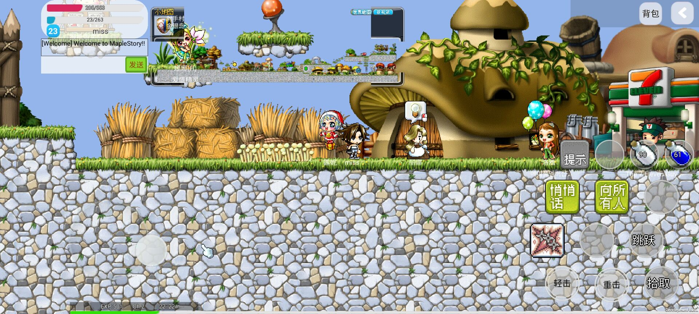
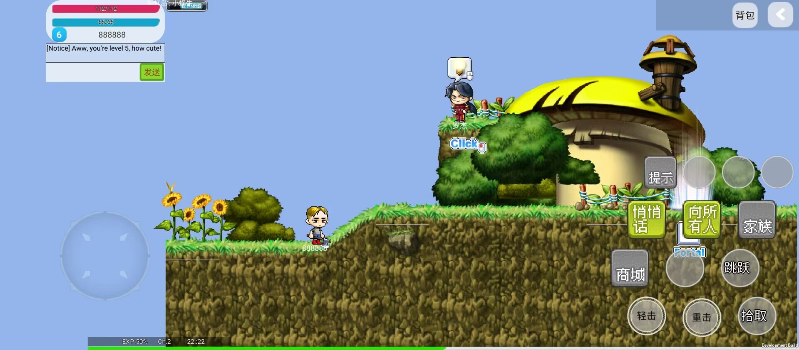

# goals
This is a custom, made-from-scratch game client，developed by unity. Aimed to make a open source crossPlatform maplestory custom client (platforms include mobile(android,ios)、pc,currently only support android) .

# features
Utilize unity crossplatform ablitity to supprt multiPlatform

# Installation guidelines
1. Open project with Unity 2022.3.13
2. Put wz files in persistant folder,See **Required Files** for a list of required wz files
3. Press **Build**.
4. After a successful build, you can now run the apk by simulator or real phone.

# code-of-conduct
reference https://opensource.guide/code-of-conduct/

# contributing guidelines
if u want to contribute this project, pls communicate on issues or discord.

# Supported versions
- The client is currently compatible with version 83 servers.
- The client has only been tested with [HeavenMS].

# Configuration
The default settings can be configured by editing the **Configuration.cs** file. These are also generated after a game session in a file called **Settings**. These can be altered in the same way as **Configuration.cs**, although, these do not persist if you delete the file, unlike **Configuration.cs**.

# Required Files
*Always check **wz.cs** for an updated list of required wz files*
- Everything else is from v83 GMS wz files

# Dependencies
[MapleLib]
[FairyGUI]
[Bass]

# Notes
Please remember this is ONLY for the development and will only be used in the support of helping further develop the client，not commercial usage. *Also please remember to support Nexon as this is not meant to replace anything Nexon offers*

Another important note to remember is that this is a free open-sourced client developed for personal use. Do NOT pay for any services requested by anyone in regards to this client. It will always remain open and free of charge. There is no intent to publish this code with any payment in mind. If that ever changes, donations and disclaimers for donations will be removed.

[HeavenMS]:          https://github.com/ronancpl/HeavenMS
[Bass]:              http://www.un4seen.com/

# Screenshots

